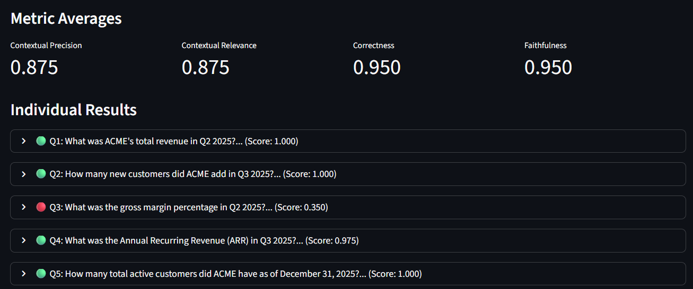

# RAG Evaluation Framework

A dashboard for systematically testing and evaluating Retrieval-Augmented Generation systems. Provides automated evaluation workflows with quality metrics, performance tracking, and configuration management for optimizing RAG pipelines.

## What This Does

Evaluate and optimize your RAG system by measuring:

- **Quality Metrics**: Four LLM-as-judge scores measuring answer correctness, faithfulness to context, and retrieval quality
- **Performance**: Retrieval latency, generation latency, and total response time per query
- **Cost Tracking**: Input/output token usage and estimated API costs per query and evaluation run
- **Configuration Impact**: Test how chunk size, similarity threshold, top-k retrieval, and prompts affect accuracy



Run evaluations against custom test sets to validate RAG behavior on domain-specific questions. Upload documents, configure retrieval parameters, run evaluations, and analyze detailed reports showing per-question scores and aggregate statistics.


## Quickstart

```bash
# Install dependencies
uv pip install .

# Copy environment variables template
cp .env.example .env
# Edit .env and add your OPENAI_API_KEY

# Run backend API
uv run uvicorn api.main:app --reload

# Run Streamlit UI (in new terminal)
uv run streamlit run ui/streamlit_app.py --server.port 8504
```

Access the UI at http://localhost:8504

## CLI Usage (Optional)

Configure parameters in `.env`, then run:

```bash
# Ingest documents from knowledge_base/ into vector store
uv run python -m scripts.cli ingest

# Query the RAG system
uv run python -m scripts.cli query --question "Your question here"

# Run evaluation on test dataset
uv run python -m scripts.cli evaluate --dataset QA_testing_sets/golden.json --num-questions 10

# Reset vector store
uv run python -m scripts.cli reset
```

## Configuration Parameters

Key parameters configurable via `.env` file or UI:

**LLM Settings**
- Model selection (generation and judge models)
- Temperature, embedding model
- Token pricing for cost estimation

**Retrieval Settings**
- `TOP_K`: Number of chunks to retrieve (affects recall vs precision)
- `SIMILARITY_THRESHOLD`: Minimum similarity score (filters low-relevance chunks)
- `CHUNK_SIZE` / `CHUNK_OVERLAP`: Document chunking strategy (affects context quality)
- `MAX_CONTEXTS_FOR_EVAL`: Contexts passed to evaluator

**Prompts**
- RAG system prompts (editable via UI)
- Evaluation judge prompts for each metric

All parameters can be modified via the Configuration page without editing `.env`. Changes are session-scoped and saved to `configs/config_overrides.json`.

## Evaluation Metrics

Each evaluation run computes four LLM-as-judge metrics:

- **Correctness**: How well the answer matches the expected answer
- **Faithfulness**: Whether the answer is grounded in retrieved contexts (no hallucination)
- **Contextual Precision**: Are relevant contexts ranked higher than irrelevant ones
- **Contextual Relevance**: Overall relevance of retrieved contexts to the question

Scores range from 0 to 1. An overall score is computed as a weighted average. Token usage and latencies are tracked for each query.

## Default Test Dataset

The framework includes a sample dataset in `default_datasets/`:

**Knowledge Base** (`example_knowledge_base/`)
- Financial earnings reports (Q1-Q3 2025) for ACME Corp
- Corporate policies (expense, security, remote work)
- Product documentation (FAQ, features, pricing)

**Test Set** (`example_test_set/golden.json`)
- 20 questions covering financial metrics, customer analytics, policies, and product information
- Each question includes expected answer and source documents for evaluation

This dataset demonstrates evaluation across different document types and question categories. Upload your own documents and test sets via the UI to evaluate domain-specific RAG performance.

## Use Cases

**Prompt Optimization**
- Test different system prompts to find the best accuracy/token trade-off
- Measure how prompt variations affect correctness and faithfulness scores

**Retrieval Tuning**
- Compare vector-only vs hybrid (keyword + similarity) retrieval accuracy
- Optimize chunk size and overlap for your document types
- Adjust top-k and similarity threshold to balance precision and recall

**Cost Analysis**
- Track token usage across prompt variants to reduce API costs
- Estimate production costs based on evaluation token averages

**Quality Assurance**
- Run regression tests with custom test sets before deploying changes
- Validate RAG behavior on edge cases and domain-specific questions

## Prompts and Extensibility

**Prompt Management**
- Edit RAG system prompts and evaluation judge prompts via UI or directly in `prompts/*.json`
- Automatic versioning with backup files
- Changes apply immediately without restart

**Adding Custom Components**
- New retrieval strategies: Add retriever classes in `rag_app/retrievers/`
- Custom metrics: Define in `eval/metrics.py` and register in `compute_metrics()`
- Alternative vector stores: Implement in storage configuration

## Evaluation Output

Each evaluation run creates a timestamped folder in `storage/runs/` containing:
- `report.jsonl`: Per-question results with scores, contexts, latencies, and token usage
- `summary.json`: Aggregate statistics across all questions
- `summary.md`: Human-readable report
- `config_snapshot.json`: Complete configuration used for the run

Reports show average scores, token usage, and cost estimates. Individual question results include retrieved contexts and metric breakdowns for debugging retrieval quality.
